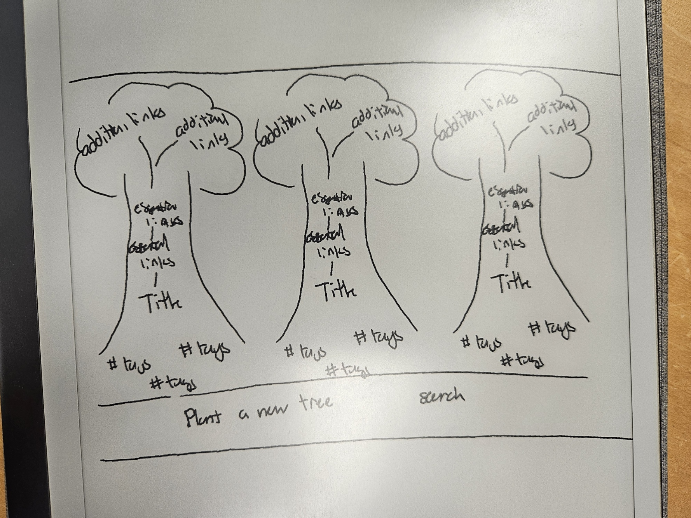
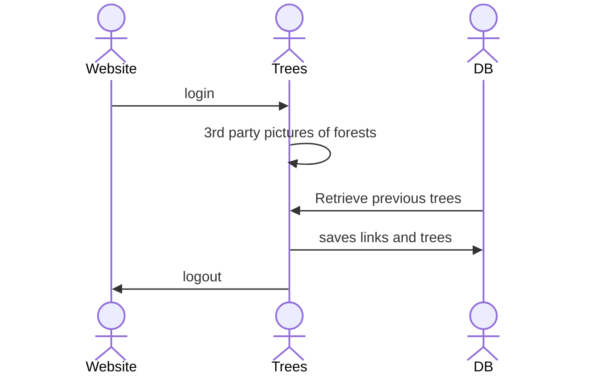

# Barkmark

[My Notes](notes.md)

An organized place for all of your common links to go to so you can open them up quickly and don't have to have keep an absurd ammount of tabs open. You can also organize them into groups for quick access. For example, if a student wanted to create a tree for each class they were in they could open the entire tree at once while leaving the other classes alone. They could have one button that would open all essential tabs, like gradescope, the syllabus and github all at once and then have the option to have addtional tabs saved for refrence if they don't want to open them. As well as a way to add tags to additonal tabs for easier searching.

## 🚀 Specification Deliverable

For this deliverable I did the following. I checked the box `[x]` and added a description for things I completed.

- [x] Proper use of Markdown
- [x] A concise and compelling elevator pitch
- [x] Description of key features
- [x] Description of how you will use each technology
- [x] One or more rough sketches of your application. Images must be embedded in this file using Markdown image references.

### Elevator pitch

Have you ever been working on projects and kept a bunch of tabs open for said project? The more tabs you get the harder it is to keep track and even impossible to do if you have to use a different computer. With Barkmark, the tree link webapp, All you have to remember is your email and password and you have access to all your tabs organized into projects and ready to start up at a moments notice with the option to keep non-essential tabs on hand for easy refrence. Great to use if you have multiple projects going on at once or even if you're a student and want to organize all your links into tabs.

### Design

Above is what the interface would look like and below is a sequence diagram of what the processes will be like. 

### Key features

- Easy and secure login
- Individual trees for personalized projects
- Each tree has essential tabs that can be opened all at once so you can get started right away
- Additional links that are saved and can be opened for refrence later
- Tags to group the additional links for easy refrence and searching later

### Technologies

I am going to use the required technologies in the following ways.

- **HTML** - Uses proper HTML structure for 3 pages. One for login, one for your trees and one for About Me page
- **CSS** - Used to style the application and design the trees to fit.
- **React** - Used for login, creating/deleting trees, adding links, adding tags, and any buttons for opening links.
- **Service** - Used for keeping track of logins and their links/trees. Also makes a call to a third party service for pictures of trees probably
- **DB/Login** - Used for keeping track of how many trees have been "planted"
- **WebSocket** - Used for keeping track of how many trees are being used at the time.

## 🚀 AWS deliverable

For this deliverable I did the following. I checked the box `[x]` and added a description for things I completed.

- [x] **Server deployed and accessible with custom domain name** - [My server link](https://yourdomainnamehere.click).

## 🚀 HTML deliverable

For this deliverable I did the following. I checked the box `[x]` and added a description for things I completed.

- [x] **HTML pages** - Created 3 pages, one from home/login, one for about - describing the use of the web app, and the "forrest page" where the links and organization is
- [x] **Proper HTML element usage** - Used proper HTML element usage to organize each page with nav, main, header and footer elements
- [x] **Links** - I created links to each individual page as well as links where people will have their own -placeheld by my github link
- [x] **Text** - Standard text for clarity and organization was added such as titles for each page as well as things like tags placeholders
- [x] **3rd party API placeholder** - The forest pictures will be taken from a web API to have random forest pictures each time
- [x] **Images** - A placeholder forest picture was added to the about and forest pages
- [x] **Login placeholder** - Login Placeholder for username and password was set
- [x] **DB data placeholder** - Db data placeholders was created for the links, usernames and tags
- [x] **WebSocket placeholder** - Websocket usage will be for seeing how many trees have been created as well as any active users

## 🚀 CSS deliverable

For this deliverable I did the following. I checked the box `[x]` and added a description for things I completed.

- [x] **Header, footer, and main content body** - I completed this by adding css to make them look good
- [x] **Navigation elements** - The navigation elements are  looking good with css
- [x] **Responsive to window resizing** - The elements resize with the window size
- [x] **Application elements** - The application elemnt are more organized and looking better.
- [x] **Application text content** - The text is colored and formatted how I want.
- [x] **Application images** - The images are added with css and look better.

## 🚀 React part 1: Routing deliverable

For this deliverable I did the following. I checked the box `[x]` and added a description for things I completed.

- [x] **Bundled using Vite** - I did not complete this part of the deliverable.
- [x] **Components** - I did not complete this part of the deliverable.
- [x] **Router** - I did not complete this part of the deliverable.

## 🚀 React part 2: Reactivity deliverable

For this deliverable I did the following. I checked the box `[x]` and added a description for things I completed.

- [ ] **All functionality implemented or mocked out** - I did not complete this part of the deliverable.
- [ ] **Hooks** - I did not complete this part of the deliverable.

## 🚀 Service deliverable

For this deliverable I did the following. I checked the box `[x]` and added a description for things I completed.

- [ ] **Node.js/Express HTTP service** - I did not complete this part of the deliverable.
- [ ] **Static middleware for frontend** - I did not complete this part of the deliverable.
- [ ] **Calls to third party endpoints** - I did not complete this part of the deliverable.
- [ ] **Backend service endpoints** - I did not complete this part of the deliverable.
- [ ] **Frontend calls service endpoints** - I did not complete this part of the deliverable.
- [ ] **Supports registration, login, logout, and restricted endpoint** - I did not complete this part of the deliverable.

## 🚀 DB deliverable

For this deliverable I did the following. I checked the box `[x]` and added a description for things I completed.

- [ ] **Stores data in MongoDB** - I did not complete this part of the deliverable.
- [ ] **Stores credentials in MongoDB** - I did not complete this part of the deliverable.

## 🚀 WebSocket deliverable

For this deliverable I did the following. I checked the box `[x]` and added a description for things I completed.

- [ ] **Backend listens for WebSocket connection** - I did not complete this part of the deliverable.
- [ ] **Frontend makes WebSocket connection** - I did not complete this part of the deliverable.
- [ ] **Data sent over WebSocket connection** - I did not complete this part of the deliverable.
- [ ] **WebSocket data displayed** - I did not complete this part of the deliverable.
- [ ] **Application is fully functional** - I did not complete this part of the deliverable.
